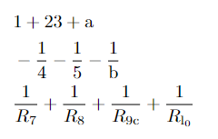

# mine
latexの自分用パッケージmine.styの複数pc間管理用兼開発用

参考：[置き場所と反映方法](https://log.mkuriki.com/latex_style_file_settings/)

## \ssum
添え字だけ違う'\frac{1}{R_{\mathrm a}}'を何個も足すのとかが面倒なので作った。
行列用に拡張したい。

`\ssum[key-valueオプション]{コンマ区切りリスト}`

### key-valueオプション一覧
- `frac` 分数にする。
- `sub` リストを添え字にする。
- `super` リストを上付き文字にする。
- `letter` 添えられる方の文字。`=`で指定。
- `l` "`letter`"の省略形。
- `ope` 項間の演算子。`=`で指定。デフォルトは`+`。
- `it` 添え字をイタリック体にする。
- `text` テキストモードにする。デフォルトはディスプレイモード。

### 例

```
\begin{eq}
  &\ssum{1,23,a}\\
  &-\ssum[frac, ope=-]{4,5,b}\\
  &\ssum[l=R, sub, frac]{7,8,9c,l_0}
\end{eq}
```
